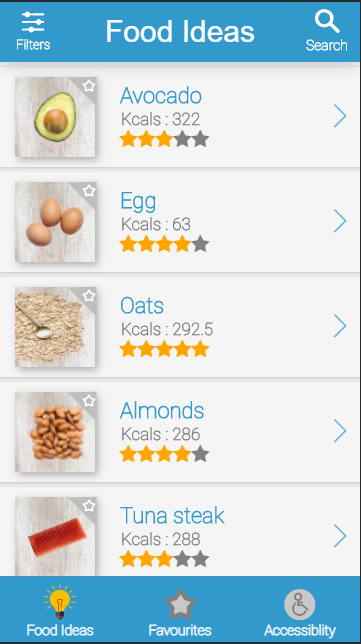

# What is it?

A very hi-fi prototype for a **mobile browser application, which is part of my User Experience Design** module at University.

# Important notice

The API is hosted on a free heroku server and the app may take up to 10 seconds to "Wake up" as a result of the free server

# Features

### - Display a list of healthy and inexpensive food to expire people to eat healthier
### - Allow users to view good points, bad points, the source of nutrition information, and adjust portion size of each individual food item
### - Add and remove food items from favourites
### - Apply filters to display certain types of food (breakfast, lunch, dinner ect)
### - Search for specific food items (also works in conjunction with filters)
####   &nbsp;&nbsp;&nbsp; By name (Avocado)
####  &nbsp;&nbsp;&nbsp;  By meal type (Lunch)
####  &nbsp;&nbsp;&nbsp;  By category (Salad)
### - Accessibility features such as
####  &nbsp;&nbsp;&nbsp; Set your own colour scheme
####   &nbsp;&nbsp;&nbsp; Set your own font size

# Live site (only optimised for mobile screens)

https://food-for-thoughtt.web.app/

# The API

https://github.com/BootstrapBilly/Food-for-though-API

# Available Scripts

In the project directory, you can run:

## `npm start`

Runs the app in the development mode. 
Open [http://localhost:3000](http://localhost:3000) to view it in the browser.

The page will reload if you make edits. 
You will also see any lint errors in the console.

